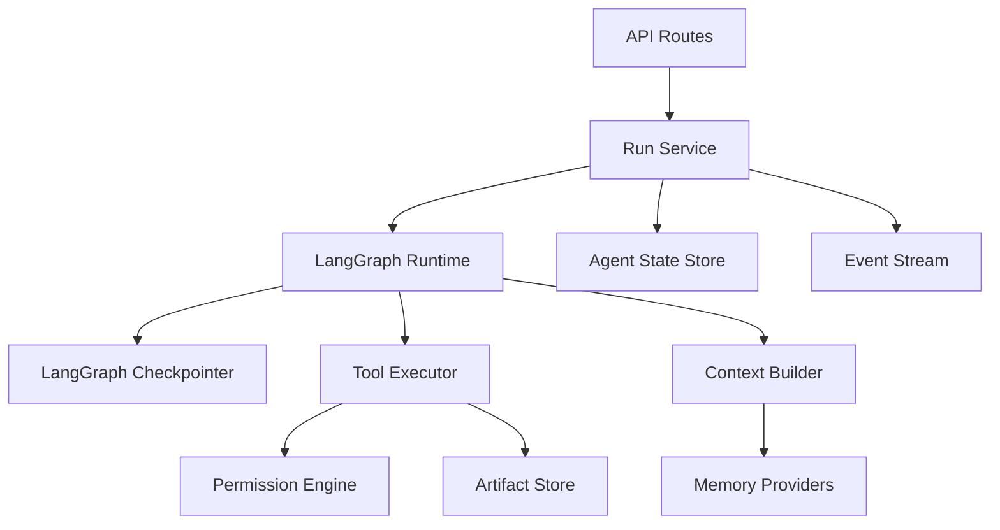

# Tommy Target Runtime Architecture

## Direction

Tommy is a LangGraph-first agent runtime. The near-term goal is not to build a heavy
multi-channel gateway. The goal is to make the core agent loop reliable, recoverable,
inspectable, and easy to extend with future workflows.

PostgreSQL is the runtime data platform for application state and LangGraph
checkpointing. The main runtime should not carry local database fallback paths or
backend conditionals.

## Reference Documents

- `agent-landscape.md`: source-level design patterns gathered from Claude Code,
  OpenCode-style agents, Hermes, OpenClaw, and LangGraph.
- `capability-gap.md`: Tommy's current capability baseline, gaps versus mature coding
  agents, and staged roadmap.
- `storage.md`: PostgreSQL source-of-truth boundaries and file/export rules.
- `memory.md`: memory layers, provider contract, retrieval, and compaction strategy.
- `langgraph-core.md`: LangGraph checkpoint, tool execution, and graph boundary notes.

## Core Layers

## Current Module Boundary

The default graph now lives under `backend/app/agent_framework/graph/`:

- `graph/builder.py`: composes and compiles the default `StateGraph`.
- `graph/nodes.py`: owns the model node and current tool/action node behavior.
- `graph/routing.py`: owns graph routing, stop checks, and tool-call extraction.
- `graph/exceptions.py`: owns graph-level exceptions such as `RunStopped`.

`backend/app/agent_framework/agent.py` is the graph construction entry point for the
application package. Detailed graph work lives in the `graph/` package.

The run/event display mapping now lives under `backend/app/agent_framework/runtime/`.
`runtime/manager.py` owns `RunManager`, `runtime/types.py` owns the run input DTO
(`RunCreatePayload`), and `runtime/run_steps.py` owns event-to-UI-step mapping.
This keeps API contracts and display mapping outside the long-running run executor.

`/health` is an end-to-end runtime surface. It reports app root, data/index paths,
configured backend choices, the active storage backend, and checkpointer state.
It is the first quick verification that API, storage, and checkpointing are all
using PostgreSQL.

Runtime settings now live in `backend/app/agent_framework/settings.py`. The first
supported environment controls are:

- `TOMMY_POSTGRES_DSN`

Store construction now enters through `backend/app/agent_framework/storage/factory.py`.
The factory returns `PostgresAgentStore`; routes, prompts, tools, and graph routing
should not instantiate stores directly.

Storage protocols live under `backend/app/agent_framework/storage/`. They define the
minimum domain surfaces that the PostgreSQL implementation should satisfy as the
runtime is split into smaller repositories.

## Responsibilities

- `GraphRuntime`: compiles and streams LangGraph graphs, owns thread config,
  checkpointer integration, interrupt/resume seams, and graph-level exceptions.
- `RunService`: owns product run lifecycle, message persistence, event publishing,
  cancellation, orphan reconciliation, and SSE replay.
- `StateStore`: owns sessions, messages, runs, events, approvals, skills, context
  pacts, memory proposals, and compaction records.
- `ContextBuilder`: builds stable system context and per-turn overlays. It should
  keep prompt memory bounded and inject retrieved memory through an explicit budget.
- `ToolExecutor`: resolves tools, injects trusted runtime context, evaluates
  permissions, records tool calls, and stores large outputs as artifacts.
- `MemoryProvider`: provides cross-session recall through prefetch, sync, extraction,
  and pre-compaction hooks.

## Near-Term Constraints

- Keep the custom `StateGraph`; do not replace it with a generic prebuilt ReAct agent.
- Do not treat LangGraph checkpoints as long-term memory. Checkpoints are thread state.
- Do not let JSONL be the runtime source of truth. It can become an export or artifact.
- Keep tool call/result pairs intact for compaction and session reconstruction.
- Preserve current API behavior while extracting modules in small, testable steps.
